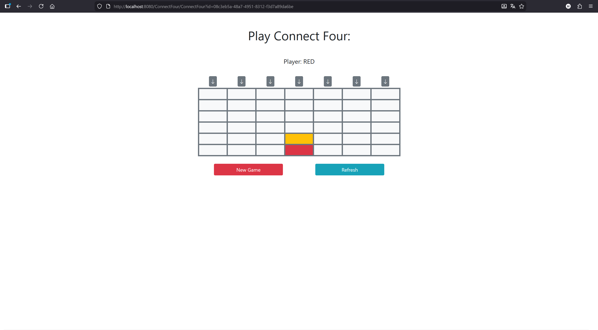
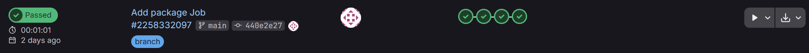
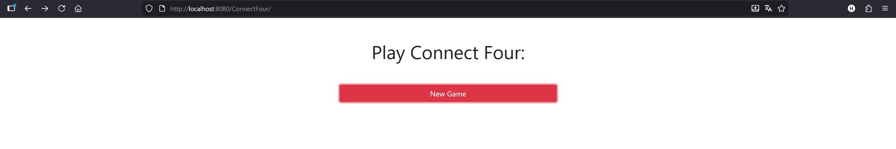
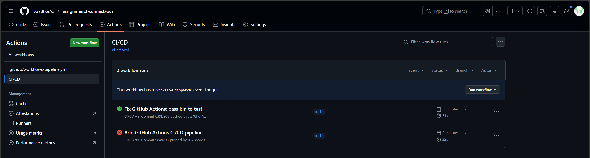
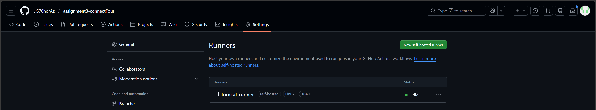
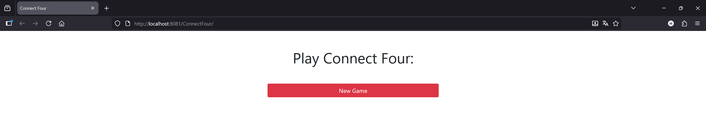
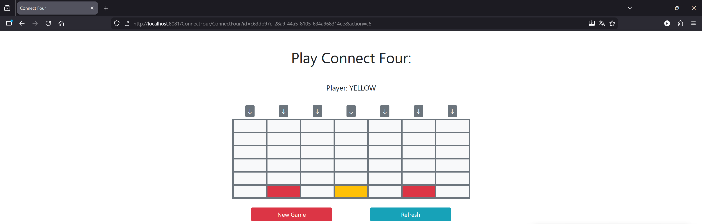

TCD3 - Assignment 3
===================

Name: BOETTGER Patrick

Effort in hours: 2

## 1. Connect Four Web Application and CI/CD Pipeline

### Task 1.a

Für Task 1.a habe ich die vorhandene Web-App-Vorlage mit meiner Connect-Four-Spielimplementierung sowie den zugehörigen Unit-Tests ergänzt. Die Spiellogik liegt im Java-Quellcode unter src/main/tcd3/connectfour, die Tests unter src/test/tcd3/connectfour. Anschließend habe ich die Anwendung lokal gebaut und als Web-Archiv paketiert, sodass eine ConnectFour.war entsteht. Diese WAR habe ich in eine lokal laufende Tomcat-Instanz deployt und die Anwendung im Browser unter http://localhost:8080/ConnectFour/ gestartet. Dabei konnte ich nachweisen, dass die Oberfläche korrekt lädt und das Spiel auf Eingaben reagiert (Spielzüge werden verarbeitet und der Zustand wird aktualisiert). Zusätzlich habe ich die Tests lokal ausgeführt und verifiziert, dass alle Tests erfolgreich durchlaufen. Damit ist die Web-Anwendung funktionsfähig und die Implementierung ist durch Tests abgesichert.

### Task 1.b

Für Task 1.b habe ich das Projekt in ein neues GitLab-Repository übertragen und anschließend einen lokalen GitLab Runner gemäß SETUP.md eingerichtet und mit dem Projekt registriert. Dabei wurden zwei Runner verwendet: ein Docker-Runner (Tag docker) für Build-, Test- und Package-Schritte sowie ein Shell-Runner (Tag shell) für den Deployment-Schritt, damit Docker-Kommandos direkt auf der lokalen Maschine ausgeführt werden können. In der Datei .gitlab-ci.yml wurde eine CI/CD-Pipeline definiert, die automatisch den Build ausführt, alle Tests startet und anschließend die Anwendung als ConnectFour.war paketiert. Das erzeugte WAR-Artefakt wird als Pipeline-Artifact bereitgestellt. Der Deploy-Job wird manuell gestartet und baut ein Docker-Image mit Tomcat, startet den Container lokal und stellt die Anwendung anschließend unter http://localhost:8080/ConnectFour/ bereit. Ich habe dokumentiert, dass alle Pipeline-Jobs erfolgreich durchlaufen und dass die Webanwendung nach dem Deployment im Browser erreichbar ist (inkl. Logs/Screenshots der erfolgreichen Pipeline und der laufenden Anwendung).

### Task 1.c

Für Task 1.c habe ich das Projekt zusätzlich in ein GitHub-Repository übertragen und eine CI/CD-Pipeline mit GitHub Actions umgesetzt. Die Pipeline führt bei jedem Push automatisch die Schritte Build, Test und Package aus, wobei die vorhandenen Skripte aus dem Projekt verwendet werden. Die Testausführung erzeugt dabei auch den Coverage-Report (JaCoCo), und das Packaging erstellt das Deploy-Artefakt ConnectFour.war, welches als Artifact bereitgestellt wird.

Für den Deployment-Schritt habe ich gemäß SETUP.md einen self-hosted Runner in einem Docker-Container mit Apache Tomcat eingerichtet (Port 8081). Der Deploy-Job läuft gezielt auf diesem self-hosted Runner, lädt das ConnectFour.war Artifact herunter und kopiert es in das Tomcat-webapps-Verzeichnis, sodass Tomcat die Anwendung automatisch deployt. Anschließend ist die Webanwendung lokal unter http://localhost:8081/ConnectFour/ erreichbar. Ich habe dokumentiert, dass der Workflow vollständig erfolgreich (grüner Actions-Run) durchläuft, der Runner online ist und die Anwendung nach dem Deployment im Browser wie erwartet funktioniert.

